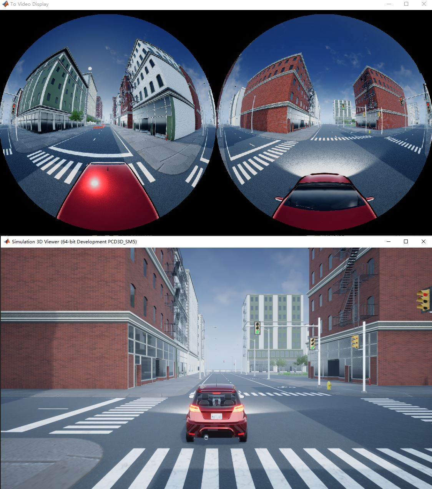

# DualFisheye Simulation

A simple 360-degree street view image simulation that outputs DualFisheye images. Compared to real physical scenes, it achieves zero parallax, allowing the mounted camera to be positioned at any custom location and angle within the simulated environment.

## Requirements

- MATLAB R2024b or later
- Simulink™
- Computer Vision Toolbox™
- Automated Driving Toolbox™
- Simulink 3D Animation™

